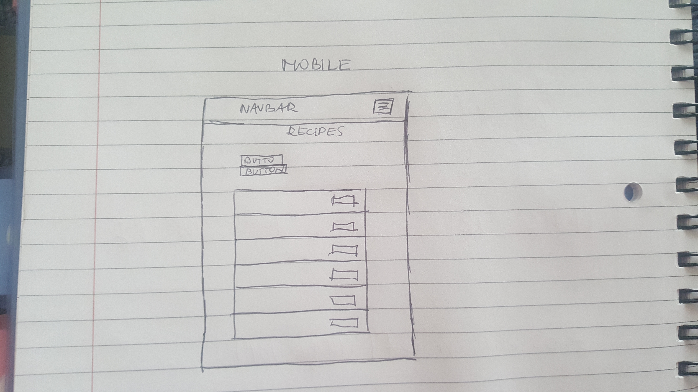
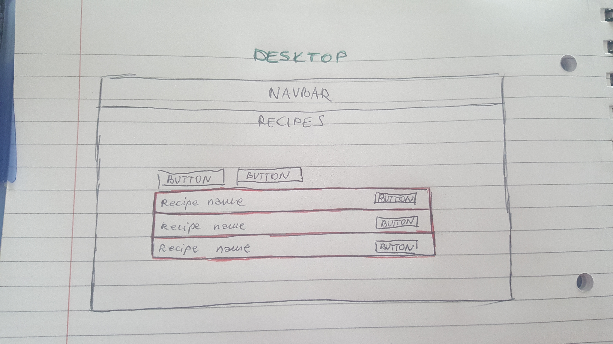

# COOK-BOOK application

## UX

I created an application called COOK-BOOK that allows user to store and easily access recipes.
The app is a recipe manager that will store all your favorite recipes in one place! It allow the user
to read recipe, create new recipe, edit and delete them (CRUD).

As a user you can:

* view the app on your preferred device (mobile, tablet, desktop)
* create your own recipe and add to the website
* edit the recipes
* delete the recipes
* see a list of all recipes
* search for recipes by choosen category
* register to the application with username and password
* login to the application with username and password
* create new cusines
* edit cusines
* delete cusines
* create new categories
* edit categories
* delete categories

### Design

I created this website using Bootstrap and Materialize. This app contain register page where new user is able to register, login page where user is able to login, home page
with navbar, buttons, and lists of recipes when clicked it will lead to individual recipe page.

## WIREFRAMES

### wireframes for mobile

### wireframes for desktop

## FEATURES

##### Existing features

* **Register page** - will allow new user to register to get access to the application

* **Login page** - will allow user to login before using the application

* **'COOK-BOOK' - logo** - when clicked it will always bring the user to the home page

* **Navbar** - created to navigate particular list: (*recipes*, *categories* or *cusines*). Across the navbar the are links
with names of the lists. When hoover over the link color will change. For smaller devices the navbar collapse 
into *burger icon*.

* **'Add New Recipe' - button** - when clicked, it will allows the user to add new recipe

* **'Search By Category' - button** - when clicked, it will allows user to search recipes by particular category

* **'View' - button** - when clicked, will bring to individual recipe page

* **'Edit Recipe' - button** - allows user to edit particular recipe and make changes

* **'Remove' - button** - allows user to remove particualar recipe

##### Features left to implement

* Feature that will allow user remove or edit(make changes) only its own recipes - but not others users recipes.

## TECHNOLOGIES USED

* **Git** - used command line to for regular commits and to push my project to github
* **Github** - used to remotely store project code and allow public to see my website
* **Bootstrap 3.3.7** - https://getbootstrap.com/docs/3.3/ bootstrap 3.3.7 used for responsive navbar, grid layout of the page;
* **JQuery 3.3.1** - to assist the bootsrap
* **Materialize 1.0.0** - https://materializecss.com/text-inputs.html used for imput fields
* **Material Design Icons** - https://material.io/resources/icons/?style=baseline used to add icons to the input fields
* **Heroku** - this application is hosted via heroku

##### Front-End Technologies

* **HTML** - to create basic structure
* **CSS** - to add styles to the websites

##### Back-End Technologies

* **Flask 1.1.1** - to construct and render templates
* **Python 3.6.8** - used as the backend programming language
* **MongoDB Atlas** - database used to storewebsite backend data
* **PyMongo 3.8.0** - used for interacting with MongoDB database from Python
* **Jinja** - to display back-end data to the front-end
* **BSON ObjectId** - allows you to create and parse ObjectIDs without a reference to the MongoDB or bson modules

## TESTING

This website had been tested on different devices such as: Desktop, Tablet, Mobile. I used Chrome DevTools to make sure it works on: Samsung Galaxy S5, iPhone 5/6/7/8, iPad, PC Desktop;

## TROUBLESHOOTING

**Registration and Login system** - that was the biggest challenge but with lots of searching in google  websites I eventually  was able to create it

##### To be fixed

Add alert messages to registration and login system: 

* when user register to the app successfully - confirmation message should pop up
* when user login and try to use the same username which already exist - warning message should pop up

## DEPLOYMENT

##### GITHUB

I deploy my project by going to GitHub, navigate to my github pages site's repository. Under my repository name I clicked Settings. Then I used the Select
drop-down menu to select master branch and then save it. Now my project is deployed to github pages and accessible to anyone via URL.

Link to my github repository: https://github.com/atena123/COOK-BOOK

##### HEROKU

In the terminal, I created a requirements.txt file using this command: pip freeze > requirements.txt.
In the terminal, I created a Procfile by running: echo web: python app.py > Procfile command.
I push these files to my GitHub repository.
I created a new app on Heroku dashboard, I named it 'COOK-BOOK and then I set the region.
I linked Github repository to Heroku.
I set the config vars as follows: IP 0.0.0.0 and PORT 5000.

My app can be found at: https://mycook-book1.herokuapp.com/

To run this project you need to do the following:

* Go to Github repository and click on the 'clone or download' and copy the link https://github.com/atena123/COOK-BOOK.git.
* Create virtual environment that helps to keep dependencies required by this project separate from other projects by creating isolated python virtual environments.
* Install all required modules by creating requirements.txt file.
* Create a .env file with the connection to MongoDB database, and a secret key.
* You can run this application by following command: python3 app.py

## CREDIT

##### Content

The Recipes I added to this page are from this website: https://www.bbcgoodfood.com/recipes/collection/easy

##### Aknowlegment

my mentor:  Ignatius Ukwuoma - my help throughout the project

